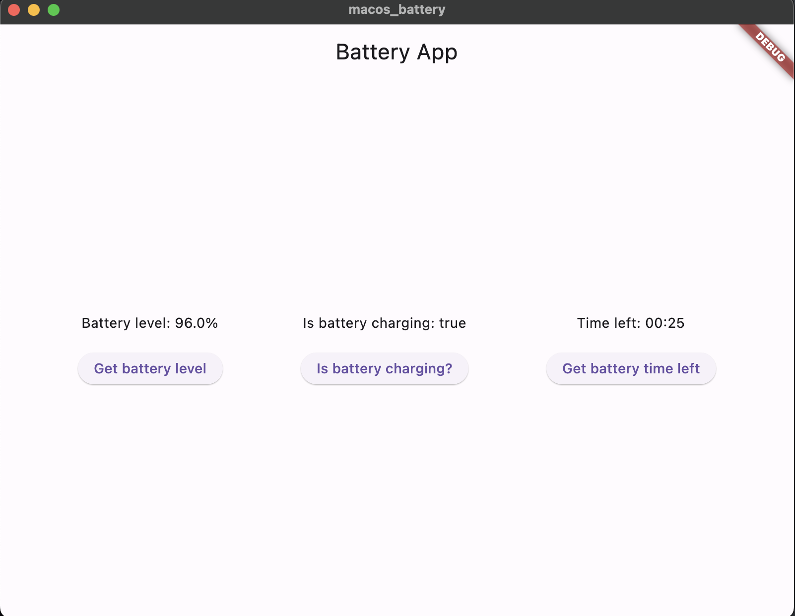
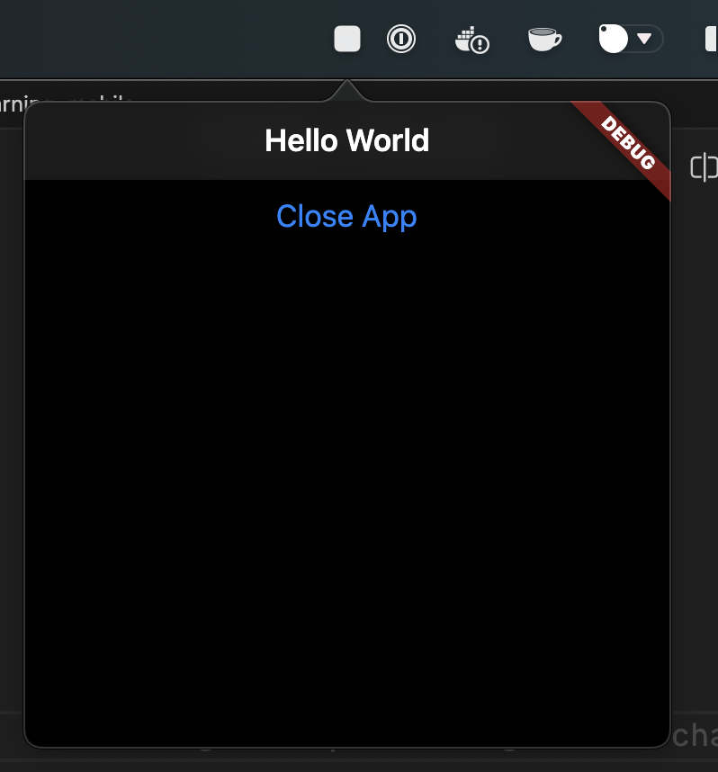

## Example APP

### Battery App

### MenuBar App

| API with Riverpod | ToDO List APP | Travel APP | IceScreeam store |
|-----------|-----------|-----------|-----------|
| <video src="https://github.com/manuelduarte077/learning-dev-mobile/assets/46093689/69a412b5-59f3-4464-989f-0f534fbd49d7" width="250"> |  |  |  |
